# AUI Android

> **🚧 Work in Progress — Not ready for production use.**
> This library is under active development and has **not been published to Maven Central** yet. APIs may change without notice. Feel free to explore the code and the demo app, but do not add it as a dependency in your project.

An open-source Kotlin library for rendering AI-driven interactive UI in Jetpack Compose.

AI assistants respond with JSON describing pre-built native components instead of plain text.
AUI parses the JSON and renders native Compose UI — cards, forms, chips, buttons, surveys — inside your app.

## Visual Examples

| AI-Generated Survey |
|:---:|
| The AI builds a multi-step survey from JSON. The library manages step navigation and consolidation; the demo hosts it in a bottom sheet, but hosts are free to pick any container. A single callback delivers the final answers to your app. |
|  |

### AUI Blocks Examples

Ordered from basic content blocks to richer composite layouts and host-routed detail flows.

| 1. Foundations | 2. Tap Actions |
|:---|:---|
| `text`, `heading`, `caption` | `button_primary`, `button_secondary`, `quick_replies` |
| 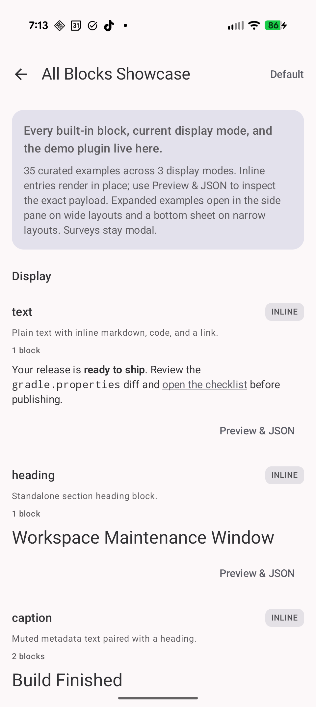 | 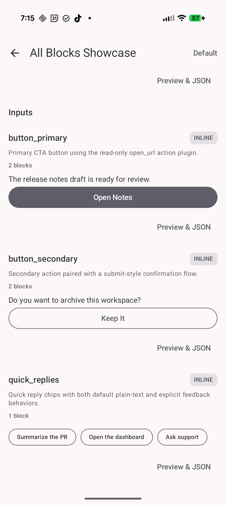 |

| 3. Single-Choice Inputs | 4. Form Inputs |
|:---|:---|
| `chip_select_single`, `chip_select_multi`, `radio_list` | `checkbox_list`, `input_text_single`, `input_slider` |
| 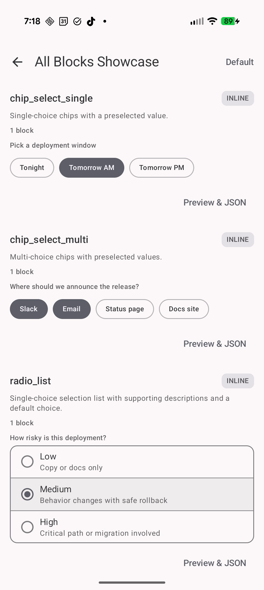 | 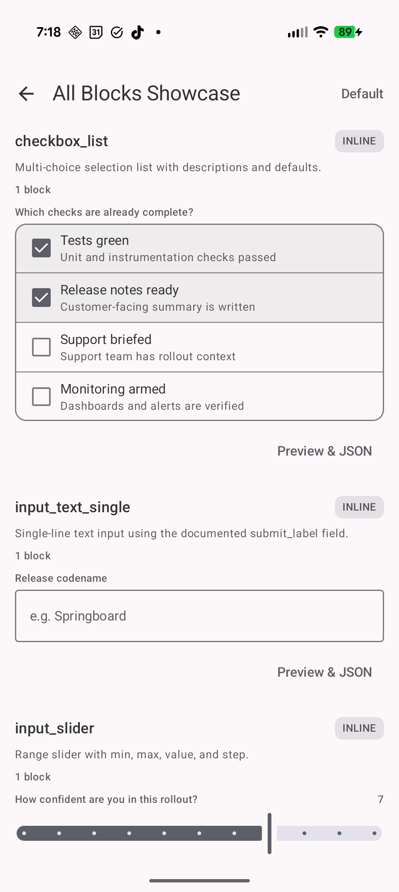 |

| 5. Feedback + Flow Layout | 6. Progress + Positive Status |
|:---|:---|
| `input_rating_stars`, `divider`, `stepper_horizontal` | `progress_bar`, `badge_info`, `badge_success`, `badge_warning` |
| 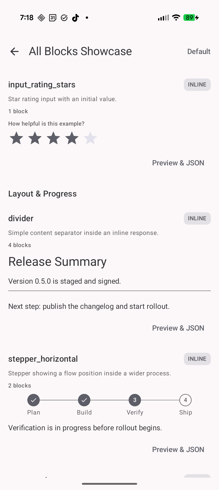 | 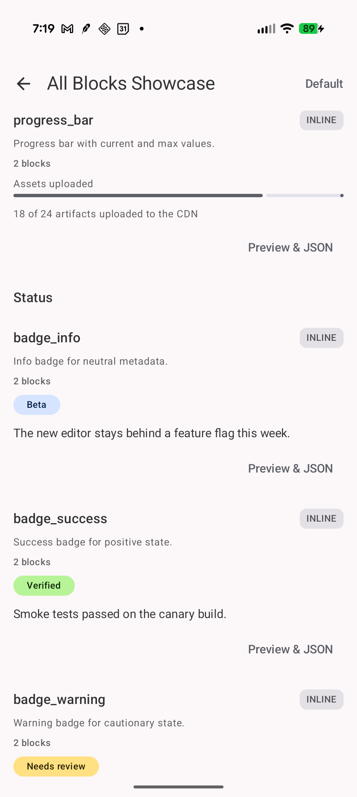 |

| 7. Error + Banner Status | 8. Rich Content Blocks |
|:---|:---|
| `badge_error`, `status_banner_info`, `status_banner_success`, `status_banner_warning` | `caption`, `file_content`, `chart` (`bar`) |
| 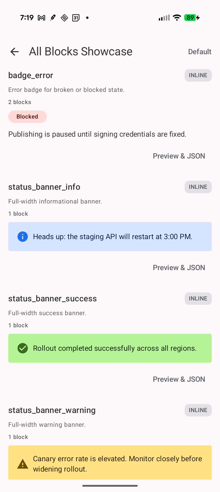 | 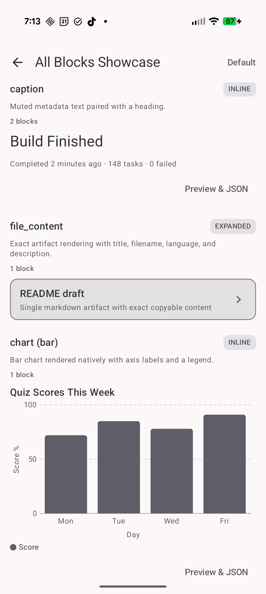 |

| 9. Data Visualization Variants | 10. Plugins + Error Handling |
|:---|:---|
| `chart` (`line`, `pie`) | `status_banner_error`, plugin-rendered blocks |
| 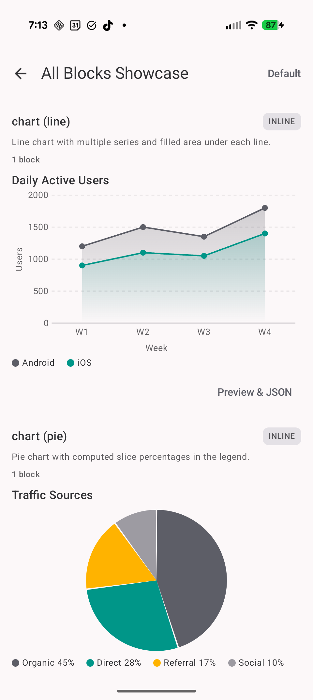 | 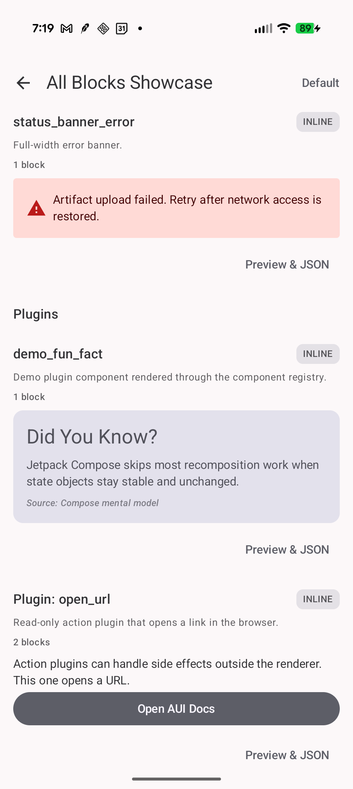 |

| 11. Composite Expanded Content | 12. Survey Host Flow |
|:---|:---|
| mixed block composition, `expanded` card preview, document draft teaser | `survey` rendered in a host-owned sheet with step navigation |
| 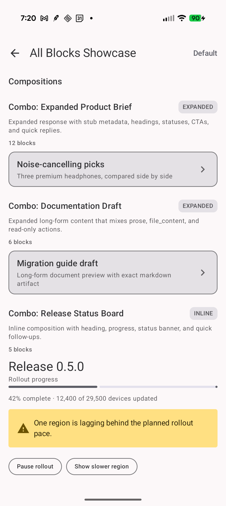 | 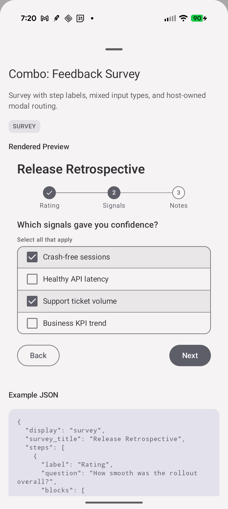 |

| 13. Document Detail Flow | |
|:---|:---|
| `expanded` document/file-style response opened in detail surface | |
| 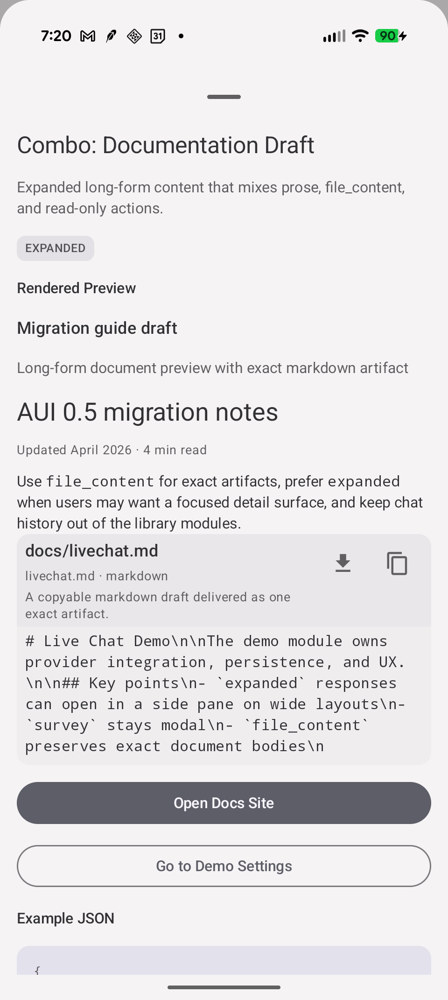 | |

## How It Works

AUI connects your app and an AI assistant through three steps:

```
┌──────────┐          ┌─────────┐          ┌─────────────┐
│ AUI      │  prompt  │   AI    │   JSON   │ AUI         │
│ Core     │ ───────▶ │ (Cloud) │ ───────▶ │ Compose     │
│ (prompt) │          │         │          │ (renderer)  │
└──────────┘          └─────────┘          └──────┬──────┘
                                                  │
                                           native Compose UI
                                                  │
                                                  ▼
                                           ┌──────────────┐
                                           │   Your App   │◀── user taps
                                           └──────────────┘    (AuiFeedback)
```

**Step 1 — AUI generates a prompt describing its components.** Your app includes it in the AI's system prompt.

```kotlin
val systemPrompt = "You are a helpful assistant.\n\n" +
    AuiCatalogPrompt.generate()
```

The generated prompt tells the AI what components exist (buttons, chips, forms, rating inputs, etc.) and how to format responses. It stays in sync with the library automatically.

**Step 2 — The AI responds with structured JSON.** Instead of plain text, the AI returns a JSON envelope with an optional `aui` field containing native UI components:

```json
{
  "text": "Which feature should we build next?",
  "aui": {
    "display": "inline",
    "blocks": [
      { "type": "radio_list", "data": {
          "key": "feature",
          "options": [
            { "label": "Dark mode", "value": "dark_mode" },
            { "label": "Export to PDF", "value": "export_pdf" }
          ]
      }},
      { "type": "button_primary", "data": { "label": "Vote" },
        "feedback": { "action": "submit", "params": {} }
      }
    ]
  }
}
```

For text-only replies, the AI simply omits the `aui` field: `{ "text": "Sure, happy to help!" }`.

**Step 3 — AUI renders native Compose UI.** Your app passes the JSON to `AuiRenderer`, which parses it and renders native components. When the user interacts (taps a button, submits a form), your app receives an `AuiFeedback` callback:

```kotlin
AuiRenderer(
    json = auiJson,
    onFeedback = { feedback ->
        // feedback.action  → "submit"
        // feedback.params  → { "feature": "dark_mode" }
        sendToAI(feedback)
    }
)
```

The library is a **pure renderer with a callback**. It does not manage chat history, conversation state, networking, or message models — those are your app's domain.

## Quick Start

### 1. Add the dependency

```kotlin
// build.gradle.kts
dependencies {
    implementation("com.bennyjon.aui:aui-compose:0.1.0")
}
```

### 2. Render AI responses

```kotlin
@Composable
fun AiMessageBubble(auiJson: String?) {
    auiJson?.let { json ->
        AuiRenderer(
            json = json,
            theme = AuiTheme.fromMaterialTheme(),
            onFeedback = { feedback ->
                // feedback.action — machine-readable action name
                // feedback.formattedEntries — human-readable Q&A summary
                // feedback.params — structured key-value data
                viewModel.handleFeedback(feedback)
            }
        )
    }
}
```

That's it. Three lines: dependency, `AuiRenderer`, `onFeedback` callback.

### 3. Include the AUI schema in your AI system prompt

```kotlin
val systemPrompt = buildString {
    append("You are a helpful assistant.\n\n")
    append(AuiCatalogPrompt.generate(pluginRegistry = myPluginRegistry))
}
```

`AuiCatalogPrompt.generate()` returns the full component catalog so your AI knows
what components are available and how to format responses. When you pass a
`pluginRegistry`, plugin component schemas and action schemas are included
automatically. It stays in sync with the library automatically.

You can tune the prompt tone and add domain-specific examples via `AuiPromptConfig`:

```kotlin
val systemPrompt = buildString {
    append("You are a shopping assistant.\n\n")
    append(AuiCatalogPrompt.generate(
        pluginRegistry = myPluginRegistry,
        config = AuiPromptConfig(
            aggressiveness = Aggressiveness.Eager,
            customExamples = listOf(
                AuiPromptExample(
                    title = "Product comparison",
                    json = """{ "text": "Compare:", "aui": { "display": "expanded", "blocks": [...] } }"""
                )
            )
        )
    ))
}
```

- **Aggressiveness**: `Conservative` (plain text default), `Balanced` (default — use components when helpful), `Eager` (prefer components for links, lists, choices).
- **Custom examples**: Appended after built-in examples. Teach the model your domain patterns without losing the library's foundational examples.

### 4. Enable prompt caching (recommended)

The AUI catalog prompt is large but identical across every request in a conversation,
making it an ideal candidate for **prompt caching**. With caching enabled, the catalog
tokens are processed once and reused on subsequent requests — significantly reducing
cost and latency.

Most LLM providers support this by marking the system prompt as cacheable:

- **Anthropic (Claude):** [Prompt Caching](https://docs.anthropic.com/en/docs/build-with-claude/prompt-caching) — send the system prompt as a content block with `cache_control` and add the `anthropic-beta: prompt-caching-2024-07-31` header. Cached tokens cost 90% less.
- **OpenAI:** [Prompt Caching](https://platform.openai.com/docs/guides/prompt-caching) — caching is automatic for prompts longer than 1,024 tokens. No code changes needed. Cached tokens cost 50% less.

## Display Levels

The AI chooses how prominently to present each response. The library itself renders
`inline` and `expanded` identically — both signal the AI's **intent**. Hosts decide
whether to surface `expanded` responses in a separate detail surface.

| Level | When to use | Library behavior |
|-------|-------------|------------------|
| **inline** | Quick replies, polls, short confirmations, single cards — anything that belongs in the chat flow. | Renders in place. Leading `text` / `heading` / `caption` blocks form the chat bubble; the rest render full-width below. |
| **expanded** | 3+ rich cards, image galleries, comparisons, long-form content the user may want to study. | Renders identically to `inline`. Hosts may route it to a bottom sheet (narrow windows) or a side detail pane (wide windows) using the included [`AuiResponseCard`](#expanded-content) stub. |
| **survey** | Multi-page structured input — 2+ questions, feedback forms, onboarding flows. | Flat content with library-injected Back / Next / Submit navigation, stepper indicator, and consolidated submission. The library does **not** wrap itself in a bottom sheet — hosts own the container. |

## Expanded content

For `expanded` responses, include `card_title` and `card_description` so the host can
render a meaningful preview stub:

```json
{
  "display": "expanded",
  "card_title": "Headphone picks",
  "card_description": "Three top noise-cancelling models compared",
  "blocks": [ ... ]
}
```

AUI ships with `AuiResponseCard` — a tappable card stub for hosts that want to surface
`expanded` (or dismissed `survey`) responses through a detail surface:

```kotlin
AuiResponseCard(
    response = parsedResponse,
    onClick = { activeMessageId = messageId },
    isActive = messageId == activeMessageId,
)
```

It reads `card_title` / `card_description` (falling back to the first heading, text, or
`survey_title`) so the stub preview is always meaningful.

The host decides what happens on tap: open a `ModalBottomSheet` on narrow windows, show the
full `AuiRenderer` in a side pane on wide windows, or anything else. The library stays out
of layout decisions.

## Handling Surveys

The library renders surveys as **flat content** — it manages step navigation and
consolidates answers, but it does not provide a sheet or dialog. The host picks the
container:

```kotlin
if (showSurveySheet) {
    ModalBottomSheet(onDismissRequest = { showSurveySheet = false }) {
        AuiRenderer(
            response = surveyResponse,
            onFeedback = { feedback ->
                showSurveySheet = false
                sendToAI(feedback)
            },
        )
    }
}
```

When the user taps the library-injected Submit button, `onFeedback` fires once with
`stepsTotal != null`, `formattedEntries` containing the full Q+A summary, and `params`
holding the merged key-value data plus `steps_total` / `steps_skipped`. Unanswered steps
are simply excluded from `entries` — users can submit any subset.

Host-driven dismissal (closing the sheet without Submit) is a host concern — the library
emits no feedback for it. You decide whether a dismissed survey stays re-openable in the
chat (via `AuiResponseCard`) or is discarded.

## Theming

AUI components never hardcode colors, fonts, or spacing. Everything goes through `AuiTheme`.

```kotlin
// Option A: Auto-map from your existing MaterialTheme
AuiRenderer(json = json, theme = AuiTheme.fromMaterialTheme(), ...)

// Option B: Provide a custom theme
val myTheme = AuiTheme(
    colors = AuiColors(primary = Color(0xFF6750A4), ...),
    typography = AuiTypography(heading = TextStyle(fontFamily = YourFont, ...), ...),
    spacing = AuiSpacing.Default,
    shapes = AuiShapes.Default
)
AuiRenderer(json = json, theme = myTheme, ...)
```

## Customization

AUI's plugin system lets you add custom components and register app-specific actions.

### Custom Component

Define a data class, implement `AuiComponentPlugin`, and register it:

```kotlin
@Serializable
data class FunFactData(val title: String, val fact: String, val source: String? = null)

object FunFactPlugin : AuiComponentPlugin<FunFactData>() {
    override val id = "fun_fact"
    override val componentType = "demo_fun_fact"
    override val dataSerializer = FunFactData.serializer()
    override val promptSchema = "demo_fun_fact(title, fact, source?) — A colorful fun-fact card."

    @Composable
    override fun Render(data: FunFactData, onFeedback: (() -> Unit)?, modifier: Modifier) {
        Card(onClick = { onFeedback?.invoke() }, modifier = modifier.fillMaxWidth()) {
            Column(Modifier.padding(16.dp)) {
                Text(data.title, style = LocalAuiTheme.current.typography.heading)
                Text(data.fact, style = LocalAuiTheme.current.typography.body)
            }
        }
    }
}
```

If your custom component collects user input, override `inputMetadata(data)` so feedback
accumulation can include that block's per-instance `key` and optional `label`.

### Custom Action

Action plugins handle side effects like navigation or opening URLs:

```kotlin
class OpenUrlPlugin(private val context: Context) : AuiActionPlugin() {
    override val id = "open_url"
    override val action = "open_url"
    override val promptSchema = "open_url(url) — Open the given URL in the device browser."

    override fun handle(feedback: AuiFeedback): Boolean {
        val url = feedback.params["url"] ?: return false
        context.startActivity(Intent(Intent.ACTION_VIEW, Uri.parse(url)))
        return true  // claimed — onFeedback will not be called
    }
}
```

Action plugins use chain-of-responsibility: return `true` to claim the feedback (host `onFeedback` skipped), or `false` to pass through.

### Building the Registry

Build one `AuiPluginRegistry` and pass it to both the renderer and the prompt generator:

```kotlin
val pluginRegistry = AuiPluginRegistry().registerAll(
    FunFactPlugin,
    OpenUrlPlugin(context),
)

// Renderer — plugins render custom blocks and handle actions
AuiRenderer(
    json = json,
    pluginRegistry = pluginRegistry,
    onFeedback = { /* only called for unclaimed feedback */ }
)

// Prompt — plugin schemas are included automatically
val systemPrompt = AuiCatalogPrompt.generate(pluginRegistry = pluginRegistry)
```

## Component Catalog

26 built-in component types across these categories:

| Category | Components |
|----------|-----------|
| **Display** | `text`, `heading`, `caption`, `file_content`, `chart` |
| **Input** | `button_primary`, `button_secondary`, `quick_replies`, `chip_select_single`, `chip_select_multi`, `radio_list`, `checkbox_list`, `input_text_single`, `input_slider`, `input_rating_stars` |
| **Layout** | `divider` |
| **Progress** | `stepper_horizontal`, `progress_bar` |
| **Status** | `badge_info`, `badge_success`, `badge_warning`, `badge_error`, `status_banner_info`, `status_banner_success`, `status_banner_warning`, `status_banner_error` |

The `text` component renders inline Markdown: `**bold**`, `*italic*`, `` `code` ``, and `[links](url)`. Structural Markdown (headings, lists, etc.) uses dedicated block types instead. For exact copyable artifacts like `.md`, `.json`, config files, or source files, use `file_content` rather than decomposing them into multiple presentation blocks.

Need something outside the catalog (e.g. product cards, maps, weather widgets)? Register
an `AuiComponentPlugin` — see [Customization](#customization). Unknown component types are
silently skipped (never crash). You can observe them via `onUnknownBlock`.

## Modules

| Module | Description | Dependencies |
|--------|-------------|-------------|
| `aui-core` | Pure Kotlin. JSON parsing, data models, validation. | Kotlinx Serialization |
| `aui-compose` | Jetpack Compose renderer, theme, components. | aui-core, Compose, Coil |
| `demo` | Sample chat app. NOT part of the library. | aui-compose |

`aui-compose` transitively includes `aui-core`, so most apps just add one dependency.

## Public API

The library exposes a deliberately small surface:

- **`AuiRenderer`** — The main composable. Two overloads: `(json: String, ...)` and `(response: AuiResponse, ...)`. Handles `inline`, `expanded`, and `survey` responses.
- **`AuiResponseCard`** — Optional host-rendered card stub for surfacing `expanded` or dismissed `survey` responses through a detail surface. Uses `card_title` / `card_description`, falling back to the first heading / text block or survey title.
- **`AuiTheme`** — Theme data class with `AuiColors`, `AuiTypography`, `AuiSpacing`, `AuiShapes`. Includes `AuiTheme.fromMaterialTheme()` for zero-config MaterialTheme bridging.
- **`AuiFeedback`** — Callback data: `action`, `params`, `formattedEntries`, `entries`, `stepsSkipped`, `stepsTotal`.
- **`AuiCatalogPrompt`** — Generates the AI system prompt text from the component catalog. Tune via `AuiPromptConfig` (aggressiveness + custom examples).
- **`AuiParser`** — JSON parser (used internally by `AuiRenderer`, but available if you need pre-parsing).
- **`AuiResponse`** / **`AuiBlock`** / **`AuiStep`** — Data models for parsed responses.
- **`AuiPluginRegistry`** — Register and look up plugins. Pass to both renderer and prompt generator.
- **`AuiComponentPlugin<T>`** — Add custom component types with custom Compose rendering.
- **`AuiActionPlugin`** — Handle named actions (navigation, URLs, etc.) with chain-of-responsibility routing. Mark `isReadOnly = true` so the renderer keeps pass-through actions enabled even after a collecting block has been spent.

Everything else is `internal`.

## Building

```bash
./gradlew build                              # Build all
./gradlew :aui-core:test                     # Test core module
./gradlew :aui-compose:testDebugUnitTest     # Test compose module
./gradlew :demo:installDebug                 # Run demo app
```

## Requirements

- Kotlin 1.9+
- Jetpack Compose (BOM)
- Min SDK 26, Target SDK 35

## Documentation

- [Architecture](docs/architecture.md) — Module structure, public API, design decisions
- [File Content Block](docs/file-content-block.md) — Reusable contract for copyable file/document artifacts across Android and future iOS renderers
- [AUI Spec](spec/aui-spec-v1.md) — Full JSON format specification
- [JSON Examples](spec/examples/) — Sample responses for each display level

## License

Apache 2.0
